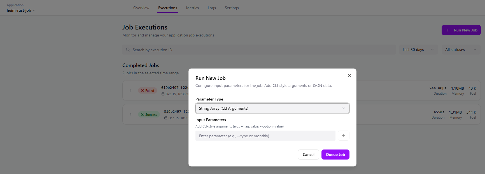
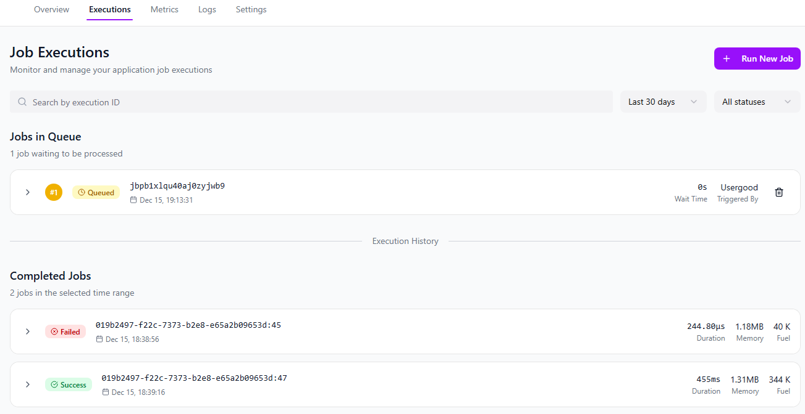
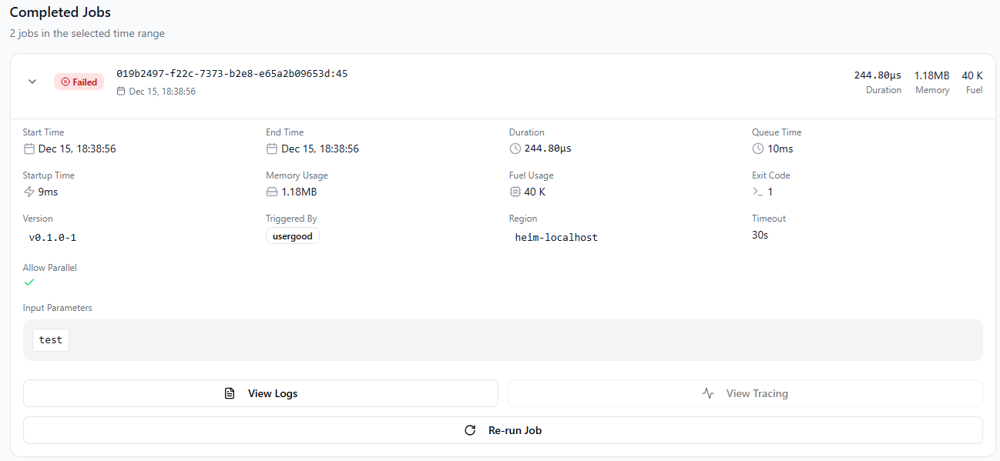

import {
  FileTree,
  Card,
  CardGrid,
  LinkCard,
  Steps,
} from "@astrojs/starlight/components";

Job application is an Heim-application with a single [Job-trigger](./../config/triggers/#job-trigger) declared. <br />
Job triggers are a work-load that only gets executed on-command, so each execution gets queued up by either or Api or through Heim-portal.<br />
This is also the only executable that accepts regular command-line arguments for each execution. <br />
Limited to maximum queue-size and how many executions you are allow per month, see [Organization Limits](./../../organization/limits/).

## Prerequisites

<LinkCard
  title="Rust Job Application"
  href="./../../../guides/examples/rust-job-application/"
/>

<LinkCard
  title="API-Token"
  href="./../../../organization/limits/"
/>

## Queue a Job
There are two way to queue up a Job, either through the Heim-portal or with the help of the API.

### Heim-portal
Go to your job-application in the Heim-portal and navigate to executions.
Here we click the button **Run New Job** and we get the possibility to trigger a new Job, together with a string-array of arguments if needed.


_Application Executions Run new job_

Here you can see your Jobs in the queue and the completed jobs.


_Application Executions Queue_

You have access to the status-card for each completed Job, where you can se the log-output for the single execution and also be able to re-run an existing Job.


_Application Executions Status_

### API
You will need an API-token created, and then you can deploy jobs with the following request.

**Endpoint**: https://cloud.heim.dev/heim/api/v2/application/heim-rust-job/add-job
**Method**: POST
Headers:
**Authorization**: Bearer < REPLACE_WITH_API_TOKEN>

```json
{
    "jobs": [
        {
            "arguments": ["arg1-for-job-1","arg1-for-job-1"]
        },
        {
            "arguments": ["arg1-for-job-2","arg1-for-job-2"]
        },
        {
            "arguments": ["arg1-for-job-3","arg1-for-job-3"]
        }
    ],
}
```
