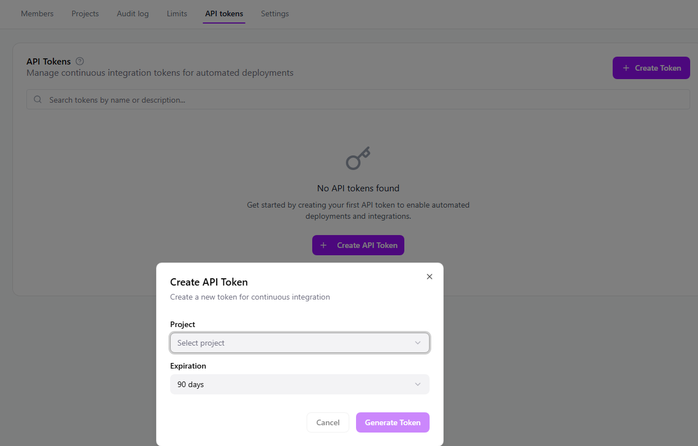

API-Tokens are can be used to deploy applications with the deploy command or used to deploy your applications with the Heim deploy GitHub Action.

There are two ways to create API-tokens. Either through the Heim Portal Organization page or through the [CLI command](./../../cli/cli-reference#ci-token-options).

_Organization API-token generate_
