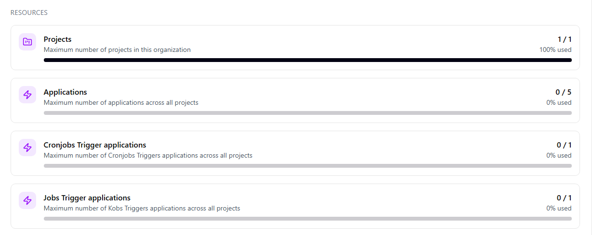
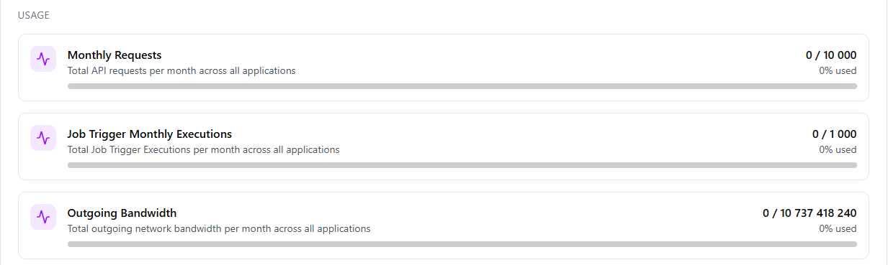
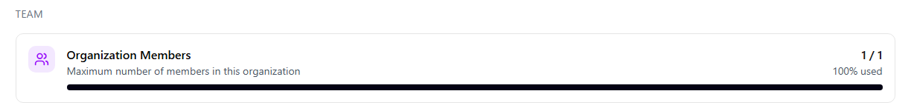
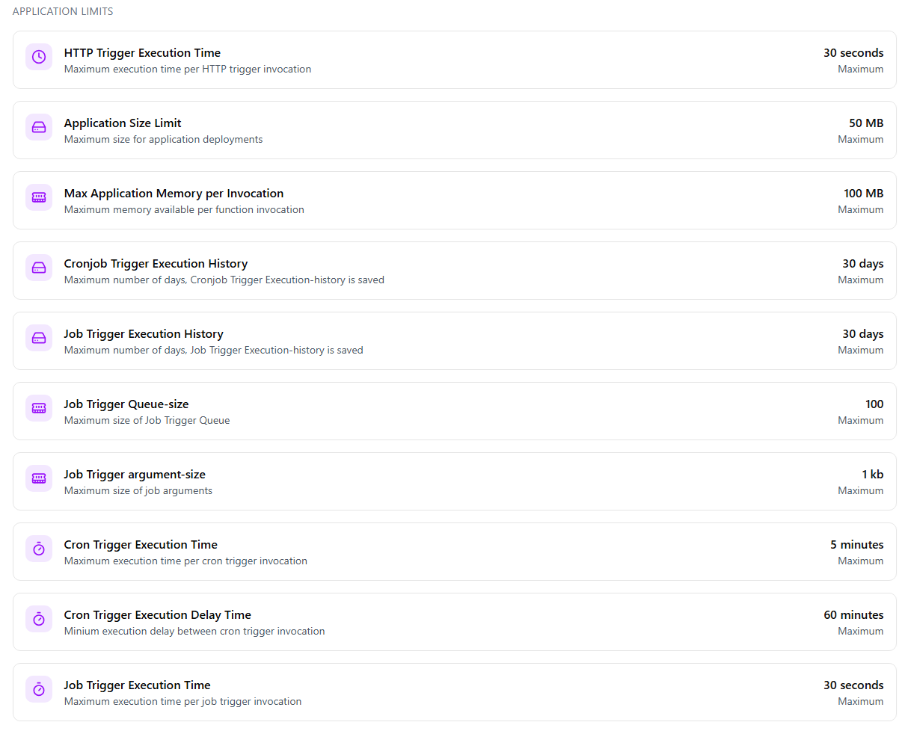

Organizations limits can be viewed in the Heim-portal.

## Resources

_Organization resource limits_

| Limit                            | Description                                                                  |
|----------------------------------|------------------------------------------------------------------------------|
| _Projects_               | Maximum number of projects in this organization..                        |
| _Applications_ | Maximum number of applications across all projects.            |
| _Cronjobs Trigger applications_             | Maximum number of CronJob Trigger applications across all projects. |
| _Job Trigger applications_ | Maximum number of Job Trigger applications across all projects. |

## Usage

Usage based limits are reset monthly.

_Organization usage limits_

| Limit                            | Description                                                                  |
|----------------------------------|------------------------------------------------------------------------------|
| _Monthly Requests_               | Total API requests per month across all applications.                        |
| _Job Trigger Monthly Executions_ | Total executions of job trigger per month across all applications            |
| _Outgoing Bandwidth_             | Total outgoing network bandwidth in bytes per month across all applications. |

## Team

_Organization team limits_

| Limit                          | Description                                                                   |
|--------------------------------|-------------------------------------------------------------------------------|
| _Organization Members_         | Maximum number of members in this organization.                             |

## Application Limits

_Organization Application Limits_

| Limit                          | Description                                                                   |
|--------------------------------|-------------------------------------------------------------------------------|
| _HTTP Trigger Execution Time_   | Maximum execution time per HTTP trigger invocation.                       |
| _Application Size Limit_ | Maximum size for application deployments.            |
| _Max Application Memory per Invocation_ | Maximum memory available per function invocation. |
| _Cron Trigger Execution History_ | Maximum number of days, Cronjob Trigger Execution-history is saved |
| _Job Trigger Execution History_ | Maximum number of days, Job Trigger Execution-history is saved |
| _Trigger Queue-size_ | Maximum size of Job Trigger Queue |
| _Job Trigger argument-size_ | Maximum size of job arguments |
| _Cron Trigger Execution Time_ | Maximum execution time per cron trigger invocation. |
| _Cron Trigger Execution Delay Time_ | Minium execution delay between cron trigger invocation |
| _Job Trigger Execution Time_ | Maximum execution time per job trigger invocation |
