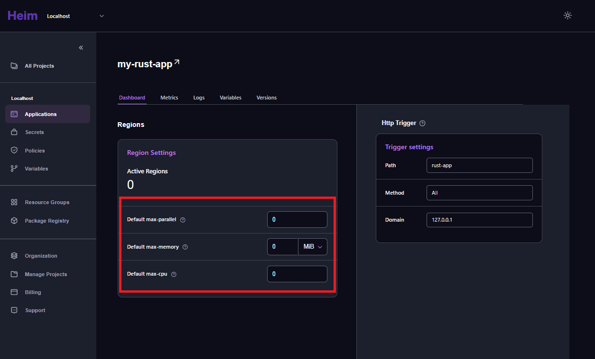
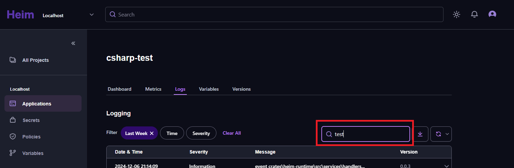
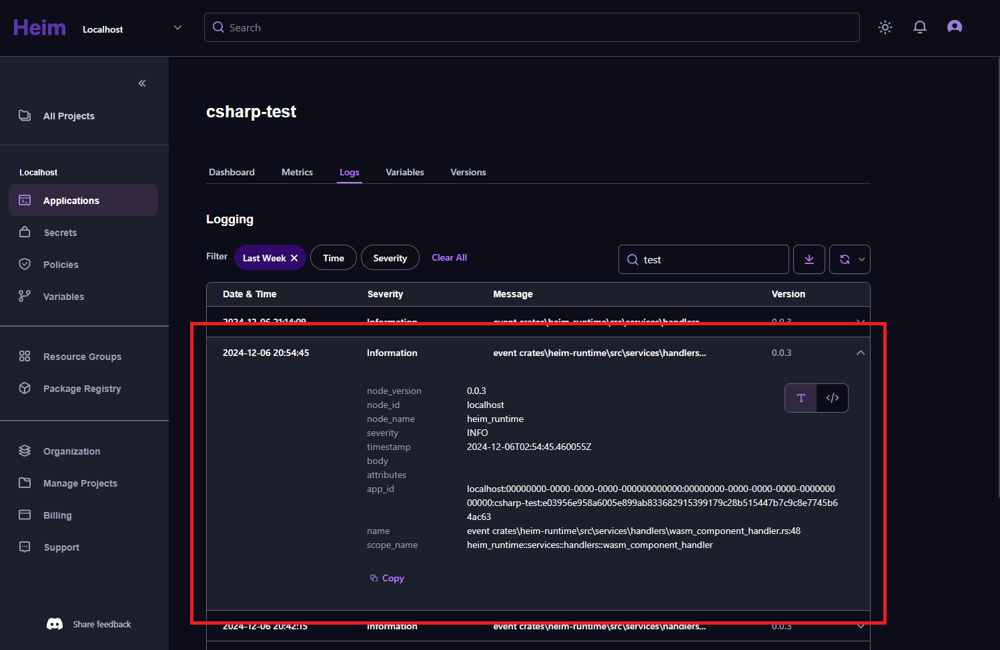

The Heim portal is a web-based GUI for Heim.

It comes bundled with Heim, and will become available when you [start the Heim runtime](../getting-started/#start-heim-runtime).

After starting the Heim runtime, you'll find the portal through the address `${server-address}/heim/portal/`. For instance, if you are running a local installation of Heim, and you start it on port 3000, the portal will be available on the address `127.0.0.1:3000/heim/portal`.

 

 

---

 

## General features

The Heim portal has a few features that will be accessible on every view. What follows is a brief overview of the currently useful general features of the Heim portal.

 

### Theming

Heim currently offers the option to choose between dark and light themes. You can change the theme you use in the Heim portal by clicking on the Heim theme selector button.

 

_Theme selection_

 

### Organization selection

In Heim, projects and their underlying data, like applications, belong to _organizations_. You can change between the organizations you have access to, via the _organization selector_.

 

_Organization selector_

 

{/* #### Login and authentication

Heim currently supports github authentication. You may log in to Heim through the login screen. Access the login screen from any page of the Heim portal by clicking the rightmost icon in the Heim portal top bar.

 

_Login screen_

  */}

### Discord link

You'll find a link to the Heim Discord server in the Heim portal sidebar.

On the Heim discord, you can discuss your experience using Heim, or contact the Heim team about issues you find.

 

 

---

 

## First page / Project list

When you first navigate to the Heim portal, you'll find yourself on the _Project list_. From here you can click on a project, which will move you along to the [_Application list_](#applications).

_List of projects_

You can get back to the project list by clicking on the `All projects` option in the Heim portal sidebar.

:::note[default selection]
When you first reach the project list, the first project on the list will be selected.
:::

 

 

---

 

## Applications

The Heim application list displays all the available applications for your selected _organization_ and _project_.

 

_List of applications_

Click on any application in the list to get to the [application dashboard](#application--dashboard) for that specific application.

 

### Applications – Search

The application list search bar allows for typing in any text value. The applications displayed in the application list will be limited to any applications matching the search value.

The Heim application search filter will look for text matches for the following values:

    - application creation date
    - application id
    - application name
    - application type
    - application version

 

_List of applications – search bar_

 

 

### Application

When you've clicked on an application in the [application list](#applications), you'll find yourself on the _Application Overview_ for that application.

The Application Overview has multiple tabs, representing different aspects of the Application:

| tab                                    | purpose                                                                                                             |
| -------------------------------------- | ------------------------------------------------------------------------------------------------------------------- |
| _[Dashboard](#application--dashboard)_ | The Dashboard is the `default` tab for the application overview. Displays general application information.          |
| _[Metrics](#application--metrics)_     | The Metrics tab displays a collection of graphs, representing useful data for the application.                      |
| _[Logs](#application--logs)_           | The Logs tab displays a list of log entries. Heim logs any significant events related to the application.           |
| _[Variables](#application--variables)_ | The Variables tab shows any environment variables used by your application, and their respective values.            |
| _[Versions](#application--versions)_   | The Versions tab shows a list of published versions for the application, and shows the details for a given version. |

Read more about the specific tabs in the sections below.

 

#### Application – Dashboard

The Application Dashboard is the default view of the Application Overview. On the Dashboard you'll find basic information about the application.

Specifically, you'll information about the application's default scaling settings, as well as any region-specific settings. You'll also find trigger settings here.

_Application dashboard_

 

##### Application – Dashboard: scaling

The scaling settings are intended for setting upper limits on resource usage for an application in Heim. They cover the following:

| name           | contents                                                                                                        |
| -------------- | --------------------------------------------------------------------------------------------------------------- |
| _max-parallel_ | max-parallel deployments in positive `integer` format                                                           |
| _max-memory_   | max allowed memory usage in string format, denoting number and unit, possible units being `KiB`, `MiB` or `GiB` |
| _max-cpu_      | max allowed cpu cores used, in positive `integer` format                                                        |

 

_Scaling section_

 

##### Application – Dashboard: triggers

Application triggers determine where and how an application responds to calls. The trigger section shows the following:

| name     | contents                                                                                                     |
| -------- | ------------------------------------------------------------------------------------------------------------ |
| _type_   | trigger type in `string` format, example: `http`, Note: The trigger type is displayed in the section Header. |
| _path_   | relative path in `string` format, example: `/test/api/` and the path can also include wildcards `*`          |
| _method_ | method value string – `GET`, `POST`, `PATCH`,`HEAD`, `OPTIONS`, `TRACE`, `PUT`, `DELETE`, `CONNECT` or `All` |
| _domain_ | domain, or base URL, the application is accessible through                                                   |

 

_Trigger section_

 

A click on the _Path_ value field copies the path value to your clipboard.

 

#### Application – Metrics

On the Metrics tab, you'll find a set of graphs, representing the following information:

| tab                    | contents                                                                                                                |
| ---------------------- | ----------------------------------------------------------------------------------------------------------------------- |
| _Memory Usage_         | Shows average memory usage values over time, and a range from lowest to highest memory usage for a given point in time. |
| _Start Time_           | Shows average application start times over time, for hot and cold application starts.                                   |
| _Fuel Usage_           | Shows average fuel usage values over time, and a range from lowest to highest memory usage for a given point in time.   |
| _Execution Time_       | Shows average application execution times for a given time interval.                                                    |
| _Executions_           | Shows application execution stats: Successful executions, unsuccessful executions and execution success rate.           |
| _Executions Over Time_ | Shows a compound bar graph with successful and unsuccessful executions over time.                                       |

 

_Application metrics_

 

The filter controls on the Metrics page allow for selecting a specific date interval, a specific time-of-day interval, and for filtering by region.

If you combine a date and a time-of-day selection, the starting time of day will be applied to the starting date, and the ending time of day will be applied to the ending date of the selection.

 

_Metrics filter_

 

 

#### Application – Logs

The application Logs tab displays a list of log entries. Heim logs any significant events related to the application, divided into the following, commonly used _severity_ categories:

- TRACE
- DEBUG
- INFO
- WARN
- ERROR
- FATAL

 

_Application log list_

 

##### Application – Logs: filter

The Heim application log list filter allow for filtering application log items by date, time-of-day, region, or severity.

If you combine a date and a time-of-day selection, the starting time of day will be applied to the starting date, and the ending time of day will be applied to the ending date of the selection.

 

_Log filter_

 

##### Application – Logs: controls

The application log list controls further expand upon the [log list filter](#application--logs-filter), adding a free-text search function through a search bar1 that lets you enter a string value, that is then matched against the log entry body and creation date. In addition, a download button2 allows you to download currently displayed log list entries in a text format file. Lastly, the refresh menu dropdown3 lets you set a refresh interval that keeps updating the application log list according to a set time interval.

_Log controls_

 

As you click on it, the search bar expands:

_Log search bar_

 

The refresh menu allows for updating your application log list every 5, 10, 30 or 60 seconds.

_Log refresh menu_

 

##### Application – Logs: List

The application log list shows a set of entries representing any significant application events, according to your [filter](#application--logs-filter) settings.

 

_Application log list_

 

Individual items in the application log list may be expanded, giving you the options to either view a _text_ view representation of the specific log entry, or a _code_ view.

The `Copy` link at the bottom of an expanded log entry lets you copy the contents of the log entry to your operating system clipboard.

 

The text view shows you a text representation of the log entry object, divided into headers and texts:

_Log entry text view_

 

The code view shows you an object representation of the log entry:

_Log entry code view_

 

#### Application – Variables

Under the Variables tab, you'll find a list of environment variables belonging to the application, if any, and their respective values:

_List of application environment variables_

 

#### Application – Versions

You'll find a list of published application versions under the Versions tab:

_List of application versions_

 

For each version, you'll find the following information:

- version number
- hash value
- creation date and times

In addition, each version entry has its own context menu (**...**).

 

##### Application – Versions: Entries

The current, or _active_ version of your application will be marked with the `active` badge:

_Active version, marked_

 

Clicking on the context menu link (**...**) on a version entry shows you a context menu for that version:

_Version context menu_

 

Clicking the _details_ button for a given version will bring up a details view for that version of the application:

_Version details_

 

 

 

---

 

## Summary

 

The Heim portal is a GUI for Heim. In the Heim portal you can select an organization and project, view a list of any [applications](#applications) for that combination of organization and project, and for each application, you may see the following:

| tab                                    | purpose                                                                                                             |
| -------------------------------------- | ------------------------------------------------------------------------------------------------------------------- |
| _[Dashboard](#application--dashboard)_ | The Dashboard is the `default` tab for the application overview. Displays general application information.          |
| _[Metrics](#application--metrics)_     | The Metrics tab displays a collection of graphs, representing useful data for the application.                      |
| _[Logs](#application--logs)_           | The Logs tab displays a list of log entries. Heim logs any significant events related to the application.           |
| _[Variables](#application--variables)_ | The Variables tab shows any environment variables used by your application, and their respective values.            |
| _[Versions](#application--versions)_   | The Versions tab shows a list of published versions for the application, and shows the details for a given version. |
